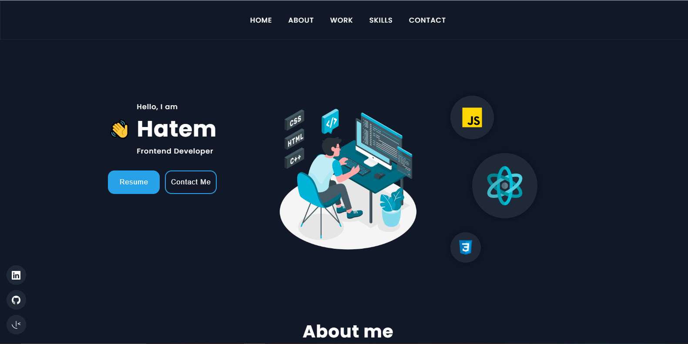
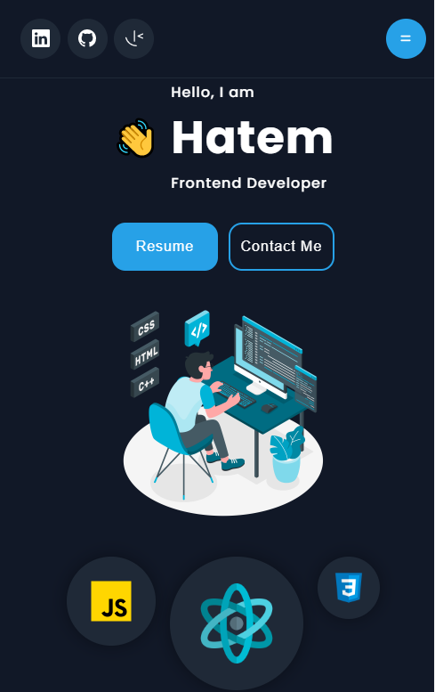
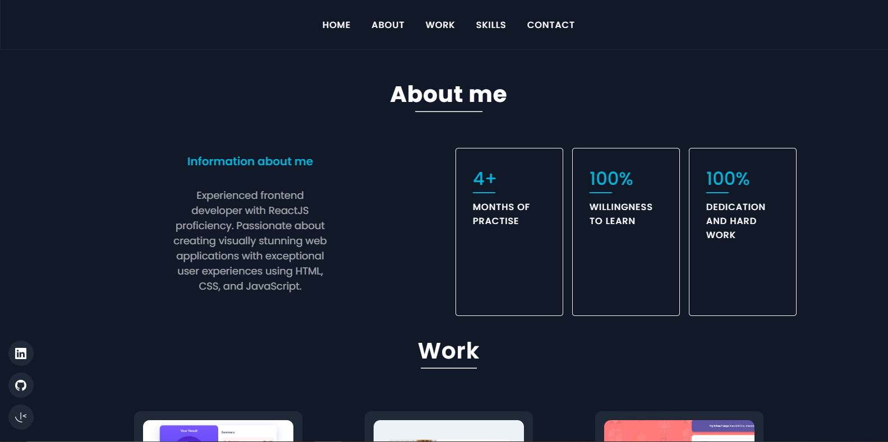
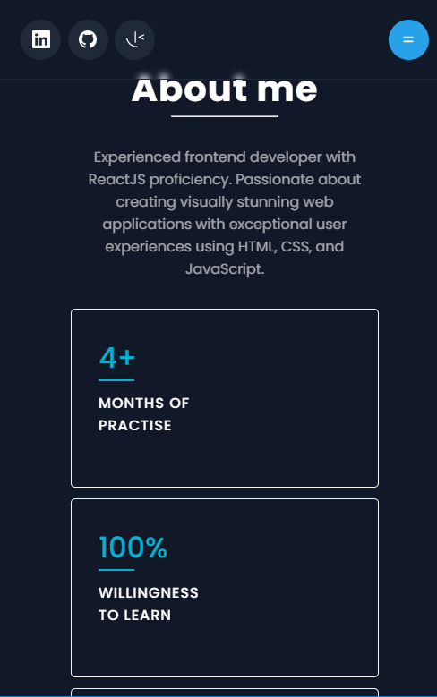
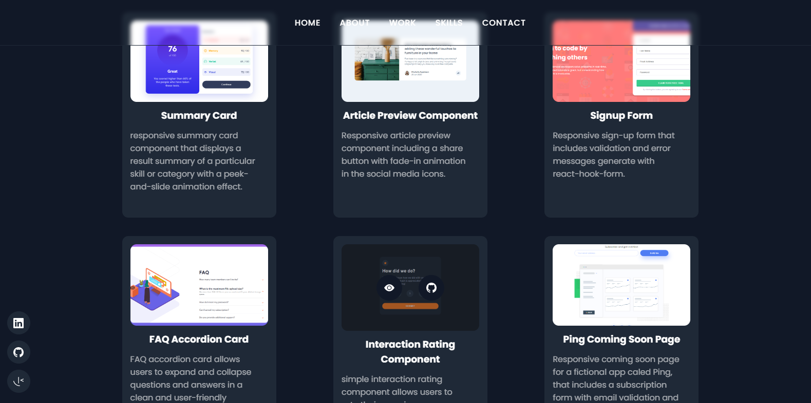
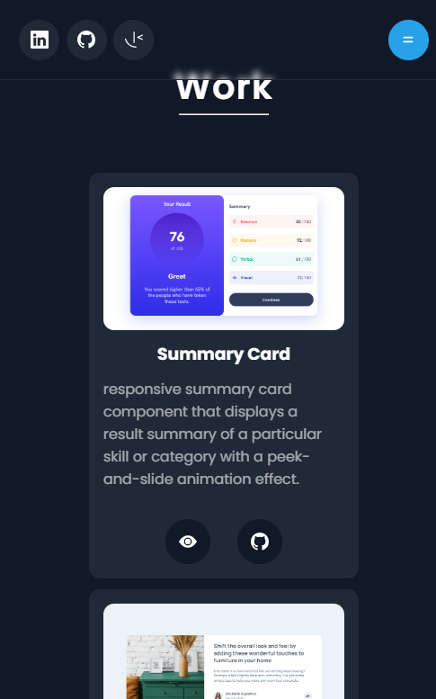
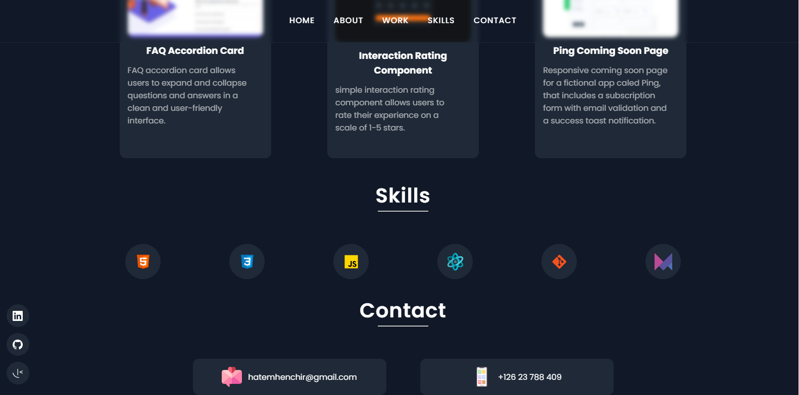
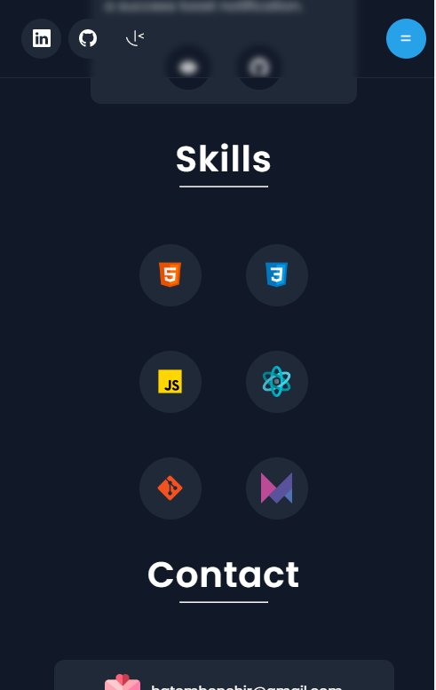
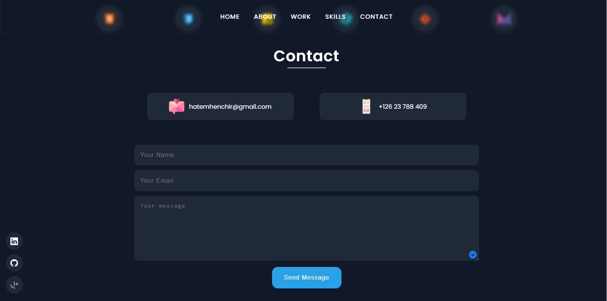
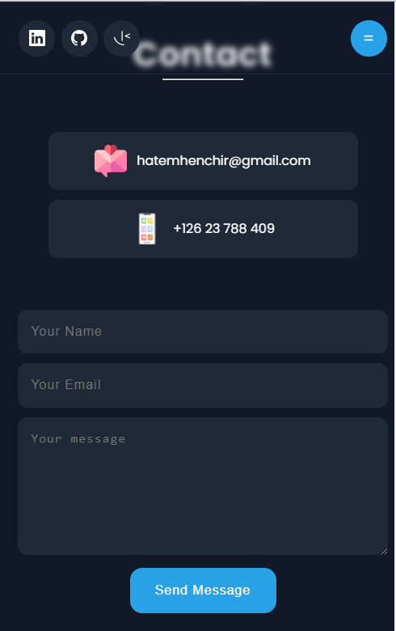

# My Portfolio

Welcome to my portfolio website! This website was built using ReactJS and Framer Motion for scroll animations. It showcases my projects, skills, and experience as a developer.

## Installation

To install the project, clone the repository and run the following command:

 `npm install`


## Usage

To run the project locally, use the following command:

`npm start`


The website will be available at http://localhost:3000.

### Navigation

The website has a navigation bar that allows users to easily navigate between different sections. The sections include:

- Home: A brief introduction to who I am and what I do.
- About: More detailed information about my background.
- Works: A showcase of my recent projects, including links to live demos and GitHub repositories.
- Skills: A list of the programming languages, frameworks, and tools that I'm proficient in.
- Contact: A form where users can send me a message.

### Animations

Framer Motion was used to create smooth and engaging scroll animations throughout the website. Here's an example of how to use Framer Motion to add a scroll animation to a component:

```jsx
import { motion } from "framer-motion";

const MyComponent = () => {
  return (
    <motion.div animate={{ y: 50 }} transition={{ duration: 0.5 }}>
      This component will move 50 pixels down when rendered
    </motion.div>
  );
};
```
### EmailJS

This project uses EmailJS to send emails from the contact form. To work with EmailJS, you need to create a `.env` file in the root directory and put the following information:
```makefile
REACT_APP_EMAILJS_SERVICE_ID=your_service_id
REACT_APP_EMAILJS_TEMPLATE_ID=your_template
REACT_APP_EMAILJS_USER_ID=your_user_id
```

Make sure to replace `your_service_id`, `your_template`, and `your_user_id` with your actual EmailJS service ID, template ID, and user ID, respectively.


## Screenshots

### Home page

|  |  |
| ------------------------------ | ----------------------------- |
| Desktop version                | Mobile version                |

### About page

|  |  |
| ------------------------------ | ----------------------------- |
| Desktop version                | Mobile version                |

### Work page

|  |  |
| ------------------------------ | ----------------------------- |
| Desktop version                | Mobile version                |

### Skills page

|  |  |
| ------------------------------ | ----------------------------- |
| Desktop version                | Mobile version                |

### Contact page

|  |  |
| ------------------------------ | ----------------------------- |
| Desktop version                | Mobile version                |

## Demo

Check out the live demo of my portfolio at https://hatemhenchir.netlify.app.

## Contributing

If you'd like to contribute to my portfolio, please open an issue or submit a pull request on GitHub.

## License

This project is licensed under the MIT License.